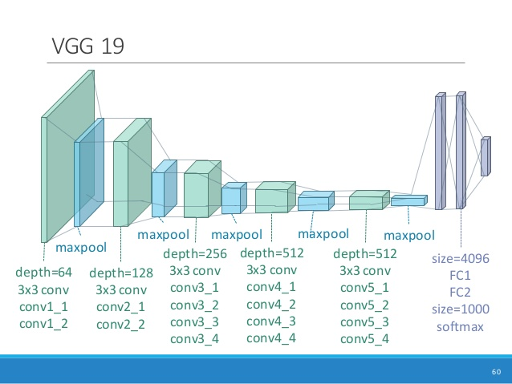

# Cat vs Dog classifier

This is a mini project about image classification to answering the input image is a dog or a cat with machine learning algorithm called convolutional neural networks (CNN).

The idea of task is proposed by [https://www.kaggle.com/c/dogs-vs-cats-redux-kernels-edition](https://www.kaggle.com/c/dogs-vs-cats-redux-kernels-edition)


## Model

I have implemented the solutions with 2 alogrithms

**The first one** is the traditional algorithm for images classify names [VGG 19](https://arxiv.org/abs/1409.1556) model, which contains 16 layers of convolution layer and 3 layers with fully-connected layer, and also insert pooling layer between 2th, 4th, 8th, 12nd convolution layer.

The input of this architecture is single image with 3 chanels color (RGB) (You maybe add some greyscale filter at 4 layer for more feature) which its size is (224, 224), the image will be resized if it's larger of smaller.

An output is the number of classes of image, which is 2 for this task (cat & dog)

More description about VGG-19 [https://arxiv.org/abs/1409.1556](https://arxiv.org/abs/1409.1556)



_Photo: VGG 19 model by [https://www.slideshare.net/ckmarkohchang/applied-deep-learning-1103-convolutional-neural-networks](https://www.slideshare.net/ckmarkohchang/applied-deep-learning-1103-convolutional-neural-networks)_

There is a great example of VGG-19 implementation with TensorFlow (which is the resource for me to study) published in [Tensorflow-Slim](https://github.com/tensorflow/tensorflow/tree/master/tensorflow/contrib/slim)

**Second Model** is more simple than the first one. It's uses only 4 layers of conv layer and 2 fully-connected layer at the last.

> I use second model because lacking of resorces. My MacBook is too slow and no enough memory to handle with large number of parameters in VGG-19 model, so I'll go on with this approach instead.

The sequence of layer
```
[Input (72, 72, 3)] -> [Conv (64)] -> [Pool] -> [Conv (128)] -> [Pool] -> [Cov (256)] -> [Cov (256)] -> [Pool] -> [Full (1024)] -> [Full (1204)] -> [Output]
```

All convolutional layers use filter size with 3 x 3, and pooling layer use sample size with 1/2, learning rate is vary but maximum with 0.01 and 0.5 dropout rate for prevent overfitting.

## Model implementation

This project has 2 version of Jupyter notebook (which works both) but different loss function and evalution.

The first version [cat-dog-classifier](src/cat-dog-classifier.ipynb) is use softmax cross entropy for loss function. The objective of this code just answer you with 2 answer, the input image is a cat and the it is a dog (result will be 0 and 1), and evaluate by accuracy metric.

The second version [cat-dog-classifier-v2](src/cat-dog-classifier-v2.ipynb) is created for answer in [Kaggle competition](https://www.kaggle.com/c/dogs-vs-cats-redux-kernels-edition), which requires answer to be probability of image, if the value is near 0, it's mean the input image is likely to be a cat, otherwise, it's likely to be a dog. The model evaluate using [log loss](https://www.kaggle.com/wiki/LogLoss) metric.

## Result

It so sad that I can't run VGG-19 with my own computer, so I recommend you to run by yourself to see the result :D

### Version 1 (Classification)

Accuracy: 0.93 - 0.96875<br>
Train steps: 11906

### Version 2 (Log Loss)

Log Loss: 0.46664 (score from Kaggle submission, which is very high but I try to optimize it)<br>
Train steps: 3567

The model already included in this repository, please feel free to test it.

## Usage

1. Clone this project
2. `docker-compose up`
3. It will show some message in terminal copy URL for terminal to browser for using Jupyter notebook
```
http://localhost:8888/?token=<TOKEN FORM TERMINAL>
```
4. Have fun !

### Model Usage

I already uploaded my model to GitHub (`/model` folder). But it's uploaded with [GitHub LFS](https://git-lfs.github.com/) (Large file storage), so you can't use it immediately after clone project. _Except you use git-lfs by default_

For download model

1. Install Git LFS [https://git-lfs.github.com/](https://git-lfs.github.com/)
2. `git lfs install`
3. `git lfs pull`
4. Check your `/model` folder to make sure your files are complete (The size of folder about ~400 MB)

## License

[MIT License](LICENSE) Copyright (c) 2017 Kosate Limpongsa